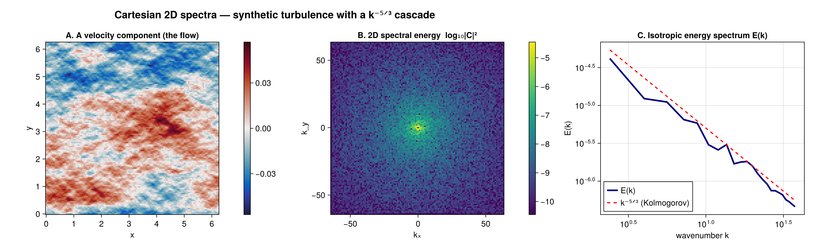
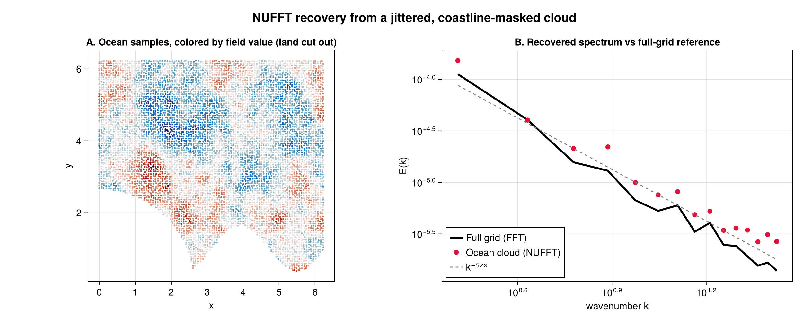
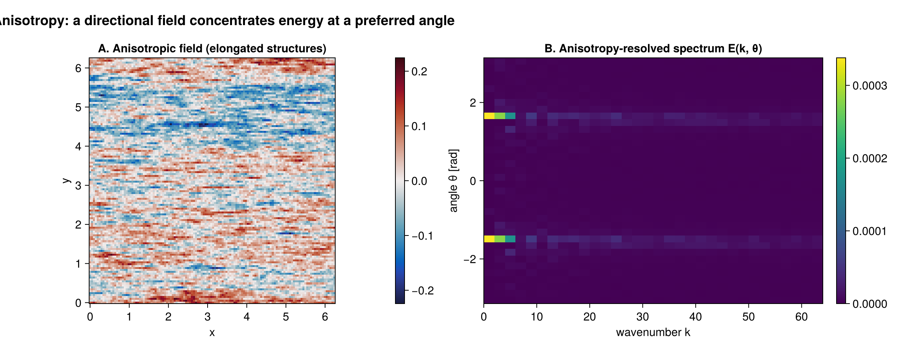
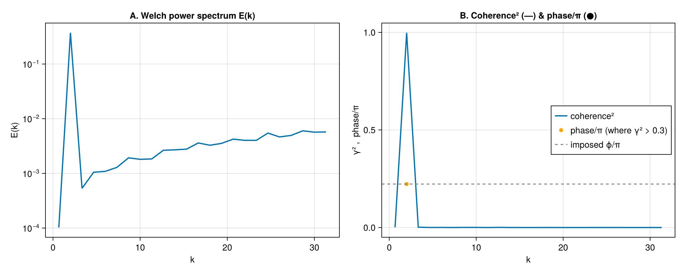
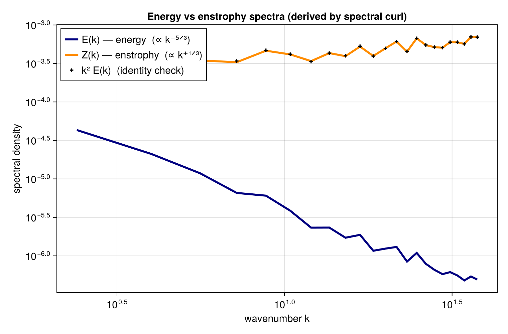
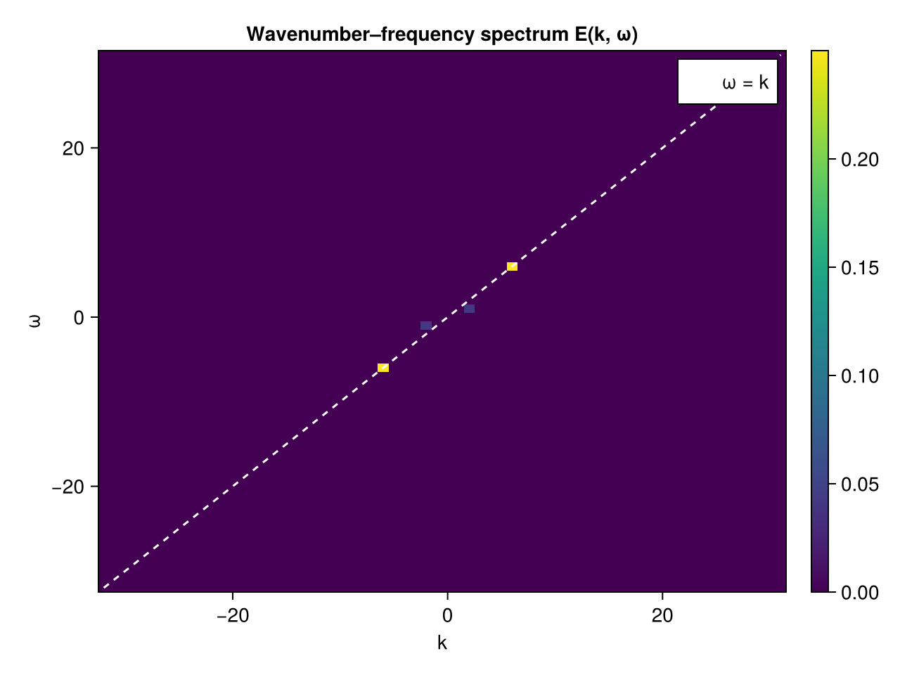
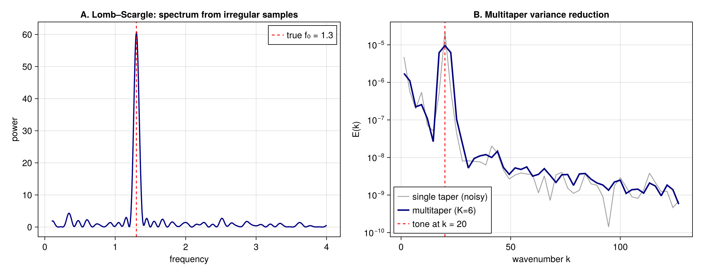
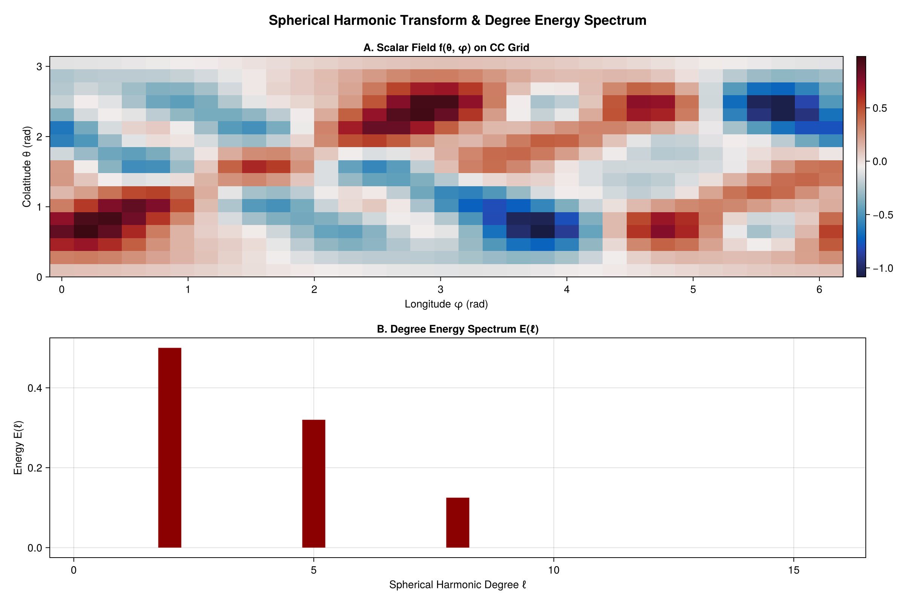
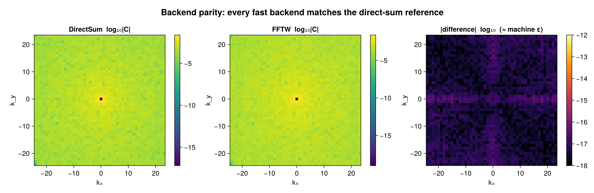

# FlowFieldSpectra.jl

*Unified, blazing-fast multi-dimensional spectral analysis and reductions for flow fields in Julia.*

[](https://github.com/jbphyswx/FlowFieldSpectra.jl/actions/workflows/CI.yml)
[](https://jbphyswx.github.io/FlowFieldSpectra.jl/dev/)

`FlowFieldSpectra.jl` simplifies computing spectral coefficients, energy spectra, and spatial reductions (such as isotropic radial integration or dimension transects) across multi-dimensional grids. It supports **Cartesian** and **Spherical** coordinates on both **structured/uniform** and **unstructured/scattered** grids.

Instead of writing custom FFT grid shifting, scaling, non-uniform coordinate mapping, or Legendre recurrence code, `FlowFieldSpectra.jl` handles the complexity behind a single type-stable function call: `calculate_spectrum`.

---

## Core Features

- **Unified, grid-typed interface**: one `calculate_spectrum` (and allocation-free `calculate_spectrum!`)
  for any combination of coordinates, grid types, and dimensions — the grid type *is* the coordinate
  system, so dispatch is exact with no coordinate guessing.
- **Cartesian & spherical**: Cartesian 1D / 2D / 3D / ND transforms; Spherical Harmonic Transforms on
  the sphere. Works for any number of field components (scalar, or 1-/2-/3-component vector flows).
- **Structured & scattered grids**: uniform/rectilinear grids, and non-uniform / scattered / random
  point clouds (e.g. masked by a coastline) — recovered correctly via non-uniform transforms.
- **Zero-dependency baseline**: works out-of-the-box via direct-sum (`DirectSumBackend`) with no heavy
  C/C++ libraries; load `FFTW` / `FINUFFT` / `FastSphericalHarmonics` / `NUFSHT` to activate the fast
  `O(N log N)` paths, plus `OhMyThreads` (threaded) and `KernelAbstractions` (GPU).
- **Reductions**: isotropic/radial binning, transects/slices, anisotropy-resolved `E(k, θ)`,
  wavenumber–frequency `E(k, ω)`, spherical degree spectra, compensated `kᵖE(k)` and band-integrated energy.
- **Cross-analysis**: cross-/co-/quadrature spectra (flux by scale, e.g. `⟨u'w'⟩`), magnitude-squared
  coherence and phase, Welch and multitaper (DPSS) variance reduction.
- **Derived-quantity spectra**: vorticity, divergence, and enstrophy spectra via spectral differentiation
  (`Z(k) = k²E(k)` holds on incompressible 2D fields).
- **Irregular sampling**: Lomb–Scargle periodogram for unevenly-sampled series (moorings, drifters, tracks).
- **Synthesis & filtering**: first-class inverse transform for spectral filtering and round-trip validation.
- **Performance**: reusable FFTW/FINUFFT plans with batched trailing axes (build once, reuse across
  z/t/components), transparent real-input `rfft` fast path, cached spherical Legendre tables, and `Float32`
  support end-to-end.
- **Plotting**: `CairoMakie` extension for spectra and backend-comparison figures.

---

## Installation

Install `FlowFieldSpectra.jl` from the Julia package manager:

```julia
using Pkg
Pkg.add("FlowFieldSpectra")
```

---

## Extension Architecture: Unlocking Fast Paths

By default, the package runs slow-path direct sums (DFT/SHT, ``O(N \cdot M)`` complexity). To unlock ``O(N \log N)`` fast paths, simply load the corresponding package:

| Grid Type | Coordinate System | Required Library | Backend Type | Description |
|---|---|---|---|---|
| **Structured** | Cartesian (ND) | `using FFTW` | `FFTBackend()` | Fast Fourier Transform via FFTW |
| **Scattered** | Cartesian (ND) | `using FINUFFT` | `NUFFTBackend()` | Non-uniform Fast Fourier Transform |
| **Structured** | Spherical (2D) | `using FastSphericalHarmonics` | `SHTBackend()` | Fast SHT on Clenshaw-Curtis grids |
| **Scattered** | Spherical (2D) | `using NUFSHT` | `NUFSHTBackend()` | Non-uniform Fast SHT |
| **Any** | Visualization | `using CairoMakie` | (Plotting Functions) | Enclosing plotting extension |

---

## Quickstart: 2D Cartesian Flow Field

Below is a complete example showing how to compute and plot the 1D isotropic energy spectrum of a 2D Cartesian flow field.

```julia
using FlowFieldSpectra: FlowFieldSpectra as FFS
using FFTW: FFTW                          # activates the FFTBackend extension
using CairoMakie: CairoMakie as Mke       # activates the plotting extension

# 1. Define a 2D Cartesian Domain
L = 10.0
N = 64
dx = L / N
xs = range(0.0, stop=L-dx, length=N)
ys = range(0.0, stop=L-dx, length=N)

# Generate coordinate lists matching a grid
xv = vec([x for x in xs, y in ys])
yv = vec([y for x in xs, y in ys])

# 2. Synthesize a 2D flow field (u, v) with specific wave components
u = @. cos(2π * 2 * xv / L) + 0.5 * sin(2π * 5 * yv / L)
v = @. sin(2π * 2 * xv / L)

# 3. Build an explicit grid and compute spectral coefficients via FFTW.
#    The coordinate system is the grid type — there is no coordinate guessing.
grid = FFS.UniformCartesianGrid((xv, yv); domain_size=(L, L))
coeffs, ks = FFS.calculate_spectrum(FFS.FFTBackend(), grid, (u, v), (N, N))

# 4. Reduce 2D Coefficients to a 1D Isotropic (Radial) Spectrum
k_bins, E_k = FFS.isotropic_spectrum(ks, coeffs; num_bins=32)

# 5. Visualize the Energy Spectrum
fig = FFS.plot_spectrum(ks, coeffs; title="Radial Energy Spectrum")
Mke.save("energy_spectrum.png", fig)
```

Construct the grid that matches your data — `UniformCartesianGrid`, `ScatteredCartesianGrid`
(NUFFT), `StructuredSphericalGrid` (SHT), or `ScatteredSphericalGrid` (NUFSHT) — and dispatch is
exact. For repeated transforms on a fixed grid (e.g. each level/time of an `(x,y,z,t)` field),
build a plan once with `plan_spectrum` and reuse it via `calculate_spectrum!`.

---

## Gallery

A quick visual tour of what the package does. Each figure is generated reproducibly by
[`docs/generate_assets/generate_assets.jl`](docs/generate_assets/generate_assets.jl), and every
capability has a runnable, rendered [example in the docs](https://jbphyswx.github.io/FlowFieldSpectra.jl/dev/).

### Cartesian spectra (FFT)



*A synthetic turbulent flow, its 2D spectral energy density, and the isotropic `E(k)` — which follows the canonical Kolmogorov `k⁻⁵ᐟ³` cascade.*

### Scattered points & coastline cutout (NUFFT)



*A field sampled only at jittered "ocean" points (land masked out) is transformed with FINUFFT; the recovered spectrum tracks the full-grid reference.*

### Anisotropy-resolved spectrum `E(k, θ)`



*A directionally biased field (elongated structures, left) concentrates its energy at a preferred angle, resolved by `E(k, θ)` (right).*

### Cross-spectra, coherence & phase



*Welch-averaged power, plus magnitude-squared coherence and the recovered phase between two fields — the basis for flux-by-scale (e.g. `⟨u'w'⟩`).*

### Derived-quantity spectra (energy vs enstrophy)



*Energy `E(k) ∝ k⁻⁵ᐟ³` and enstrophy `Z(k) ∝ k⁺¹ᐟ³` via spectral differentiation; the `Z(k) = k²E(k)` identity holds exactly on an incompressible field.*

### Wavenumber–frequency spectrum `E(k, ω)`



*Time as a spectral axis: a propagating wave sits on the `ω = k` dispersion line, separating waves from a slower background.*

### Irregular sampling & windowed estimation



*Lomb–Scargle recovers a tone from unevenly-sampled data (left); multitaper (DPSS) averaging cuts the variance of a short record's spectrum (right).*

### Spherical harmonic degree spectrum



*Scalar field on a Clenshaw–Curtis grid (left) and its energy per spherical-harmonic degree ℓ (right). Scattered nodes use the NUFSHT backend.*

### Backend parity (validation)



*DirectSum vs FFTW coefficients agree to machine precision — every fast backend is checked against the direct-sum reference.*

---

## Core API Reference

See the [API reference](https://jbphyswx.github.io/FlowFieldSpectra.jl/dev/api/) for the full surface.

### Spectral calculation
- `calculate_spectrum(backend, grid, fields, ms; kwargs...)`: complex coefficients + physical wavenumber grids.
- `calculate_spectrum!(coeffs, plan, fields)` / `plan_spectrum(backend, grid, T, ms; n_transf)`: reusable plans with batched trailing axes for allocation-free repeated transforms.
- `synthesize(grid, coeffs, ms)`: inverse transform (spectral filtering, round-trip).

### Reductions
- `isotropic_spectrum(ks, coeffs; num_bins)`: radial integration to a 1D energy-density spectrum.
- `transect_spectrum(ks, coeffs, dims)`: integrate out specific dimensions (e.g. a zonal spectrum).
- `anisotropic_spectrum(ks, coeffs; num_k_bins, num_θ_bins)`: anisotropy-resolved `E(k, θ)`.
- `spherical_energy_spectrum(coeffs; lmax)`: energy per spherical degree `ℓ`.
- `compensate(k, E, p)` / `band_energy(k, E, k1, k2)`: `kᵖE(k)` and band-integrated energy.

### Cross-analysis & estimation
- `cross_spectrum` / `cospectrum` / `quadspectrum`: scale-by-scale covariance (flux by scale).
- `coherence_spectrum`, `welch_power_spectrum`, `dpss`: coherence/phase and variance reduction (Welch, multitaper).
- `lomb_scargle(t, y, freqs)`: periodogram for irregularly-sampled series.

### Derived quantities
- `spectral_vorticity(ks, coeffs)` / `spectral_divergence(ks, coeffs)`: spectral-differentiation operators.

### Plotting (with `CairoMakie`)
- `plot_spectrum(ks, coeffs; title)`: plot 1D/2D Cartesian or spherical energy spectra.
- `compare_spectra(spectra_list; labels)`: overlay multiple 1D spectra.
- `compare_spectral_analysis(true_coeffs, approx_coeffs)`: spectral errors and coefficient deviations.


### References