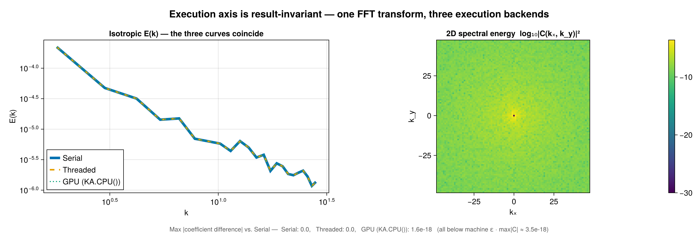

# Backends and Extensions

`FlowFieldSpectra.jl` separates spectral algorithms from library dependencies using Julia 1.9+'s package extensions mechanism. By default, the core package is extremely lightweight and has no heavy external compiled dependencies (like FFTW or FINUFFT).

To activate optimized, high-performance backends, you simply import the corresponding package in your workspace.

Backends come in **two orthogonal axes** that compose freely — the public API takes one of each as
the `transform=` and `execution=` keywords. The tag types live in two shared packages:

- **Transform** (`SpectralBackends.AbstractSpectralBackend`) — *which spectral math*:
  `DirectSumSpectralBackend`, `FFTSpectralBackend`, `NUFFTSpectralBackend`, `FSHTSpectralBackend`,
  `NUFSHTSpectralBackend` (from [SpectralBackends.jl](https://github.com/jbphyswx/SpectralBackends.jl)).
  Covered by the matrix below.
- **Execution** (`ComputationalBackends.AbstractExecutionBackend`) — *where/how it runs*:
  `SerialBackend`, `ThreadedBackend`, `GPUBackend`, `DistributedBackend`, `MPIBackend`, `AutoBackend`
  (from [ComputationalBackends.jl](https://github.com/jbphyswx/ComputationalBackends.jl)). Covered in
  [Execution backends](@ref) below.

```julia
using SpectralBackends: SpectralBackends as SB
using ComputationalBackends: ComputationalBackends as CB

# FFT transform, run threaded:
calculate_spectrum(grid, fields, ms; transform = SB.FFTSpectralBackend(), execution = CB.ThreadedBackend())
# Fast NUFFT on a CUDA GPU (cuFINUFFT):
calculate_spectrum(grid, fields, ms; transform = FFS.FINUFFTBackend(), execution = CB.GPUBackend(CUDABackend()))
```

---

## The default: `AutoSpectralBackend`

`transform` defaults to `AutoSpectralBackend()`, which picks the fastest transform the grid admits among
the extensions you have loaded. It only ever selects a backend computing the **same** coefficients — an
FFT is exact against the direct sum, and a NUFFT or NUFSHT matches it to its requested tolerance — and it
checks each backend's precondition first, so the transform it names always applies:

| grid | Auto selects | precondition |
| :--- | :--- | :--- |
| uniform structured Cartesian | `FFTSpectralBackend()` | `ms[d] == size(grid, d)` on every axis; `using FFTW` |
| uniform in some directions, stretched in others | `FFTSpectralBackend()` (hybrid) | axis 1 uniform; `using FFTW` + a NUFFT provider |
| nonuniform structured / scattered / curvilinear Cartesian | a NUFFT provider | `using NonuniformFFTs` or `using FINUFFT` |
| FastTransforms' Clenshaw–Curtis sphere | `FSHTSpectralBackend()` | grid size matches `ms` and the nodes are that grid; `using FastSphericalHarmonics` |
| any other spherical grid | `NUFSHTSpectralBackend()` | `using NUFSHT` |
| nothing loaded for it | `DirectSumSpectralBackend()` | warns once, naming the package to load |

Two entry points differ. `calculate_spectrum!(coeffs, grid, field, ms)` is implemented for the direct
sum, whose transform needs no plan, so Auto names it there; the library transforms execute in place
through a plan. And `plan_spectrum` raises for `DirectSumSpectralBackend()`, which precomputes nothing a
plan could hold.

## Backend Selection Matrix (transform axis)

To choose explicitly, match the grid structure (structured vs. scattered/non-uniform) and coordinate system (Cartesian vs. Spherical):

| Coordinate System | Grid Structure | Baseline Backend | Fast Backend | Required Library |
| :--- | :--- | :--- | :--- | :--- |
| **Cartesian** | Uniform / Regular | `DirectSumSpectralBackend()` | `FFTSpectralBackend()` | `using FFTW` |
| **Cartesian** | Uniform in some directions, stretched in others | `DirectSumSpectralBackend()` | `FFTSpectralBackend()` (hybrid) | `using FFTW` + a NUFFT provider |
| **Cartesian** | Nonuniform tensor grid (all axes stretched) | `DirectSumSpectralBackend()` | `NonuniformFFTsBackend()` | `using NonuniformFFTs` |
| **Cartesian** | Scattered / Unstructured | `DirectSumSpectralBackend()` | `FINUFFTBackend()` | `using FINUFFT` |
| **Cartesian** | Curvilinear (`CurvilinearGrid`) | `DirectSumSpectralBackend()` | `FINUFFTBackend()` / `NonuniformFFTsBackend()` | `using FINUFFT` / `using NonuniformFFTs` |
| **Spherical** | Structured (Clenshaw-Curtis) | `DirectSumSpectralBackend()` | `FSHTSpectralBackend()` | `using FastSphericalHarmonics` |
| **Spherical** | Iso-latitude rings (HEALPix, reduced Gaussian) | `DirectSumSpectralBackend()` (ring-factorized) | — | none |
| **Spherical** | Scattered / Unstructured / panel pixelizations | `DirectSumSpectralBackend()` | `NUFSHTSpectralBackend()` | `using NUFSHT` |
| **Spheroid** | any surface `(λ, φ)` grid | `DirectSumSpectralBackend()` | `NUFSHTSpectralBackend()` | `using NUFSHT` |

### Spheroid grids

A spherical harmonic is orthonormal over *directions*, and a `SpheroidGeometry` stores the **geodetic**
latitude — which is not the colatitude of the direction its node lies in (the two differ by up to ~0.19°
at mid-latitudes on Earth's ellipsoid). Each node is therefore embedded through the geometry's own
`geodetic_to_cartesian` and its geocentric direction read back, and the grid's own area measure supplies
the quadrature. What you get is the **surface** expansion of the field, as a geodetic field expansion
uses. The spheroid's radius varies with latitude; that radial dependence belongs to the solid-harmonic
expansion, which this package does not implement.

Because a spheroid is a surface of revolution, the direction does not depend on longitude, so a
structured spheroid grid's latitude rows remain iso-latitude and it takes the ring-factorized path. A
grid carrying height as a third direction is not the domain of a surface expansion and raises; build the
surface grid and pass the levels as trailing batch dims.

### Curvilinear grids

A `CurvilinearGrid` stores one coordinate array per direction holding a value per cell, so `x = x(i,j)`
and `y = y(i,j)` each depend on both indices and the phase `exp(-i(kₓx + k_y y))` admits no factorization
into a product over axes. (A `StructuredGrid` stores one axis per direction, which is where its separable
per-axis passes come from.) A curvilinear grid therefore transforms as a **point cloud**: every path a
node cloud takes serves it — the direct sum on any execution backend, both NUFFT providers one-shot and
through `plan_spectrum`, both inverses, and the Distributed/MPI point partition. A curvilinear grid over a
*spherical* geometry takes the per-point spherical projection, since it declares no iso-latitude
structure.

### Spherical layout routing

The spherical transform picks its algorithm from the grid's **sampling**, whose traits
(`FlowGeometries.SphericalSampling.is_tensor_product`, `is_iso_latitude`) state the structure it has —
not from the grid's Julia type, which cannot distinguish the middle case:

| layout | grids | algorithm | cost |
| :--- | :--- | :--- | :--- |
| tensor product | `StructuredGrid` (Gauss–Legendre, Clenshaw–Curtis, Driscoll–Healy, lat–lon) | longitude DFT on the shared `λ` axis, then a θ-Legendre contraction | `O(nlat·L²)` |
| iso-latitude rings | `HEALPixGrid`, `RingGrid` (reduced/octahedral Gaussian) | longitude sum per ring (each ring has its own `nlon` and quadrature weight), then the same θ contraction over rings | `O(N·L + nrings·L²)` |
| point cloud | `UnstructuredGrid`, `CubedSphereGrid`, `IcosahedralGrid`, `YinYangGrid`, Fibonacci nodes | per-point projection | `O(N·L²)` |

Whether a grid's quadrature is *exact* at its stated band limit is also a declared trait,
`admits_exact_bandlimited_quadrature`: true for Gauss–Legendre, Driscoll–Healy and the reduced Gaussians,
**false** for Clenshaw–Curtis (whose weights support analysis only to `lmax ≈ (nlat−1)/2`) and for the
equal-area pixelizations. Use a Gauss–Legendre grid when analysis must be exact at the band limit.

Measured single-harmonic round trips at each sampling's own band limit:

| sampling | `nlat` | `bandlimit` | exact by trait | round trip |
| :--- | :--- | :--- | :--- | :--- |
| Gauss–Legendre | 8 / 12 | 7 / 11 | yes | 2.0e-15 / 1.2e-15 |
| Driscoll–Healy | 12 | **5** | yes | 2.9e-16 |
| Clenshaw–Curtis | 8 | 7 | no | 1.2e-01 |

**Degrees are checked against the sampling.** `ms[1] - 1` is the requested degree, and each sampling
states what its latitude count supports through `SphericalSampling.bandlimit`. That relation varies by
sampling: Driscoll–Healy's is `nlat÷2 - 1` where Gauss–Legendre's and Clenshaw–Curtis's are `nlat - 1`.
Asking for a higher degree emits one warning naming the limit and returns the coefficients, so a caller
who wants them still gets them. `McEwenWiauxSampling` has no implemented latitude quadrature upstream and
raises.

---

## Detailed Backend Profiles

### `DirectSumSpectralBackend`
- **Use Case**: Reference calculations, small grids, or zero-dependency runs.
- **Mathematical Method**: Direct Discrete Fourier Transform (DFT) summation or Spherical Harmonic Transform (SHT) direct integration via Legendre recurrence relations.
- **Complexity**: ``O(N \cdot M)``, where ``N`` is the number of grid nodes and ``M`` is the number of spectral modes.
- **Dependencies**: None.

### `FFTSpectralBackend`
- **Use Case**: Traditional uniform Cartesian grids (e.g. models on regular grids), and grids that are
  uniform in some directions and stretched in others (e.g. uniform in `x`/`y`, stretched in `z`).
- **Mathematical Method**: Fast Fourier Transform (FFT) via `FFTW.jl`. Uniformity is read **per axis**
  (`FlowGeometries.Grids.isuniform(grid, d)`, a type trait — the axis must be an `AbstractRange`). A grid
  uniform in every direction takes the pure FFT. A grid uniform in only some directions takes a **hybrid**
  transform: one FFT across all the uniform axes, then a 1-D type-1 NUFFT along each stretched axis, with
  every other spatial and batch dimension carried as that pass's batch. Axis 1 must be uniform; where it
  is stretched, use a NUFFT backend, whose separable path transforms every axis.
- **Complexity**: ``O(N \log N)`` uniform; hybrid pays the NUFFT only along the stretched axes.
- **Dependencies**: Requires `using FFTW`. The hybrid also needs a NUFFT provider for its stretched axes
  (`using NonuniformFFTs` or `using FINUFFT`); choose it with `nufft = NonuniformFFTsBackend()`, or leave
  the default and whichever provider is loaded is used.

```julia
# uniform in x, stretched in z: FFT along x, 1-D NUFFT along z
grid = FG.Grids.StructuredGrid(FG.Geometry.CartesianGeometry{Float64}(),
    range(0, 2π; length = Nx + 1)[1:Nx],      # an AbstractRange ⇒ uniform
    stretched_z;                              # a Vector ⇒ stretched
    periodic = (true, true), period = (2π, 2π))
coeffs, ks = FFS.calculate_spectrum(grid, f, (Nx, Nz); transform = SB.FFTSpectralBackend())
```

### NUFFT — `FINUFFTBackend` / `NonuniformFFTsBackend`
- **Use Case**: Scattered spatial points in Cartesian coordinates (e.g. ship tracks, sensor arrays, float data).
- **Mathematical Method**: Non-Uniform Fast Fourier Transform (Type-1). `SpectralBackends.NUFFTSpectralBackend`
  is the abstract math; a *provider* is a library choice, so FlowFieldSpectra exposes two symmetric,
  concrete backends (neither is a default) — pass one as `transform=`:
  - **`FINUFFTBackend()`** — via `FINUFFT.jl` (`using FINUFFT`; GPU via cuFINUFFT on CUDA).
  - **`NonuniformFFTsBackend()`** — via `NonuniformFFTs.jl` (`using NonuniformFFTs`); a real-data fast path
    (real-to-complex FFT — ≈2× faster and half the memory when the field is real).
- **Complexity**: ``O(N \log N + M \log(1/\epsilon))``.
- **Dependencies**: `using FINUFFT` and/or `using NonuniformFFTs`. Both may be loaded at once.

### `FSHTSpectralBackend`
- **Use Case**: Regular spherical model grids (equiangular, Clenshaw-Curtis, etc.).
- **Mathematical Method**: Fast Spherical Harmonic Transform via `FastSphericalHarmonics.jl`.
- **Complexity**: ``O(L^3)`` or ``O(L^2 \log L)``, where ``L`` is the maximum degree (`lmax`).
- **Dependencies**: Requires `using FastSphericalHarmonics`.

### `NUFSHTSpectralBackend`
- **Use Case**: Unstructured grids on the sphere (e.g., geodesic grids, scattered ocean stations, planetary orbit tracking).
- **Mathematical Method**: Non-Uniform Fast Spherical Harmonic Transform via `NUFSHT.jl`.
- **Complexity**: ``O(M \log M + N \log(1/\epsilon))`` (where ``M`` is number of modes, ``N`` is number of points).
- **Dependencies**: Requires `using NUFSHT`.
- **Note on Coefficient Recovery**: Because scattered points are unstructured, the direct SHT projection (adjoint) is not the exact inverse. The backend supports an iterative Conjugate Gradient solver via `solve=true` to accurately reconstruct coefficients from scattered data.
- **NUFFT engine**: `nufft=` picks NUFSHT's internal non-uniform FFT (a `NUFSHT`/`SpectralBackends` marker; default `AutoSpectralBackend()` ⇒ FINUFFT). Pass `nufft=NUFSHT.NonuniformFFTsBackend()` for the real-data half-spectrum fast path on a real field. A reusable plan (`plan_spectrum` + `calculate_spectrum!`) presets the points / NUFSHT plan / CG workspace once for a fixed point set.

---

## Execution backends

The execution axis chooses *where and how* the chosen transform runs; it is independent of the
transform axis. Defaults to `AutoBackend()`.

| Execution backend | Required library | Notes |
| :--- | :--- | :--- |
| `SerialBackend()` | none | Single-threaded CPU (always available). |
| `ThreadedBackend()` | `using OhMyThreads` | Multithreaded CPU: parallelises the direct-sum loop; sets the internal thread count of the FFTW (`FFTSpectralBackend`) and FINUFFT (`FINUFFTBackend`) plans (`NonuniformFFTsBackend` manages its own internal threading). `FSHTSpectralBackend`/`NUFSHTSpectralBackend` have no distinct threaded path (execution is a documented no-op there). |
| `GPUBackend(dev)` | `using KernelAbstractions` (+ vendor pkg) | GPU execution on the KernelAbstractions device `dev` (see the GPU table below). |
| `DistributedBackend(inner)` | `using Distributed` | Splits work across worker processes, each running `inner` locally. Parametric, e.g. `DistributedBackend(ThreadedBackend())`. Requires `addprocs` + `@everywhere using FlowFieldSpectra`. |
| `MPIBackend(inner)` | `using MPI` | Splits work across MPI ranks, each running `inner` locally; partials combined with `MPI.Allreduce!`. `MPIBackend(GPUBackend(dev))` targets a multi-GPU cluster. Launch under `mpiexec`. |
| `AutoBackend()` | — | Picks `ThreadedBackend` when OhMyThreads is loaded and `Threads.nthreads() > 1`, else `SerialBackend`. Never auto-selects GPU/Distributed/MPI (those need explicit context). |

Point-partitionable transforms (`DirectSumSpectralBackend`, the NUFFT backends, and
`NUFSHTSpectralBackend` in projection mode) distribute over the point/sample axis and sum the complex
coefficients; `FFTSpectralBackend`/`FSHTSpectralBackend` (which need the full grid on one process)
distribute over the batch/field axis instead.

The execution axis is **result-invariant**: it changes only where/how a transform runs, never the
answer. One FFT transform under `SerialBackend`, `ThreadedBackend`, and `GPUBackend(KA.CPU())`
returns identical coefficients (to machine ε):



### GPU transforms on any KernelAbstractions device

`GPUBackend{B}` is parametric on the KernelAbstractions device object `B`. Data is staged to that
device (`KA.allocate` + `copyto!`), and the transform runs there:

- **`FFTSpectralBackend`** is device-generic through `AbstractFFTs.plan_fft`, which dispatches on the
  device *array type*: CUFFT on a `CUDABackend` (`CuArray`), rocFFT on a `ROCBackend` (`ROCArray`), and
  FFTW on `KA.CPU()` (plain `Array`). Requires `using KernelAbstractions` + the FFT provider for your
  device (`FFTW` for CPU arrays, `CUDA` for CUDA, `AMDGPU` for ROCm). This is *not* CUDA-specific.
- **`DirectSumSpectralBackend`** uses the portable KernelAbstractions direct-sum kernels on any KA device.
- **`FINUFFTBackend`** on a GPU uses cuFINUFFT — **CUDA-only** (FINUFFT.jl provides no portable GPU
  NUFFT). On a non-CUDA device it raises.
- **`NonuniformFFTsBackend`** on a GPU is **device-generic** through KernelAbstractions: it threads the
  execution backend into `NonuniformFFTs.PlanNUFFT(…; backend=…)` and reconstructs FFS's full centered
  spectrum with broadcasts / a KA kernel (real-input fast path included), so the same code runs on CUDA,
  ROCm, and `KA.CPU()`. This is the portable GPU scattered-Cartesian NUFFT; `DirectSumSpectralBackend`
  remains the ``O(N M)`` portable fallback.
- **Spherical** (`FSHTSpectralBackend`/`NUFSHTSpectralBackend`/`DirectSumSpectralBackend`) always uses
  the KA spherical direct-sum kernel — FastSphericalHarmonics and NUFSHT are CPU-only, so **there is no
  fast GPU spherical-harmonic transform**.

| Transform | Grid | `GPUBackend(CUDABackend())` | `GPUBackend(KA.CPU())` / other KA device |
| :--- | :--- | :--- | :--- |
| `FFTSpectralBackend` | uniform Cartesian | CUFFT (via AbstractFFTs) | FFTW on `KA.CPU()`, rocFFT on ROCm, … (via AbstractFFTs) |
| `FINUFFTBackend` | scattered Cartesian | **cuFINUFFT** — `using CUDA, FINUFFT` | errors (cuFINUFFT is CUDA-only) |
| `NonuniformFFTsBackend` | scattered Cartesian | NonuniformFFTs (device-generic, via `CUDA`) | NonuniformFFTs on any KA device (`KA.CPU()`, ROCm, …) |
| `DirectSumSpectralBackend` | any Cartesian | KA direct-sum kernel | KA direct-sum kernel |
| `DirectSumSpectralBackend`/`FSHTSpectralBackend`/`NUFSHTSpectralBackend` | any spherical | KA spherical direct-sum kernel | KA spherical direct-sum kernel |

The device-generic FFT, direct-sum, and NonuniformFFTs NUFFT paths are exercised on CI via
`GPUBackend(KA.CPU())`. The CUDA-specific paths (CUFFT on `CuArray`, cuFINUFFT) are validated on real
CUDA hardware via the package's `gpu/` project — CI has no GPU.
