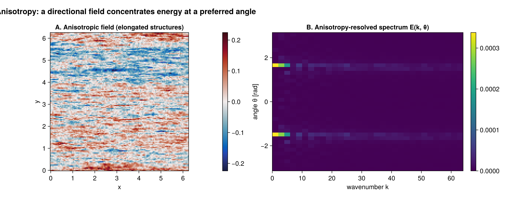

# Cartesian spectra (FFT)

A synthetic **incompressible turbulent** field with a Kolmogorov `k⁻⁵ᐟ³` energy cascade, its 2D
energy-density map, and the various 1D reductions. The figures are rendered by the package's
`docs/generate_assets/generate_assets.jl` script; the code shown here reproduces them.

```julia
using FlowFieldSpectra: FlowFieldSpectra as FFS
using FFTW: FFTW                          # activates the FFTBackend extension
using Random: Random

L = 2π
N = 64
dx = L / N
xs = range(0.0, stop = L - dx, length = N)
xv = vec([x for x in xs, y in xs])
yv = vec([y for x in xs, y in xs])

# Synthetic turbulence: a broadband streamfunction ψ, then u = ∂ψ/∂y, v = -∂ψ/∂x (spectral
# derivatives), so the velocity is incompressible with an E(k) ∝ k⁻⁵ᐟ³ cascade.
Random.seed!(1)
freq = [0:(N ÷ 2 - 1); -(N ÷ 2):-1] .* (2π / L)        # FFTW-order wavenumbers
ψ̂ = FFTW.fft(randn(N, N))
for j in 1:N, i in 1:N
    k = hypot(freq[i], freq[j])
    ψ̂[i, j] *= k == 0 ? 0.0 : k^(-(11 / 3 + 1) / 2)
end
u = vec(real(FFTW.ifft([im * freq[j] * ψ̂[i, j] for i in 1:N, j in 1:N])))
v = vec(real(FFTW.ifft([-im * freq[i] * ψ̂[i, j] for i in 1:N, j in 1:N])))

grid = FFS.UniformCartesianGrid((xv, yv); domain_size = (L, L))
coeffs, ks = FFS.calculate_spectrum(grid, (u, v), (N, N); transform = FFS.FFTBackend())
```

## Isotropic (radial) energy spectrum

```julia
k_bins_iso, E_k = FFS.isotropic_spectrum(ks, coeffs; num_bins = 32)
rng = 2:findlast(<=(0.6 * maximum(k_bins_iso)), k_bins_iso)   # resolved inertial range
```


## Transect spectrum

Integrate out the second axis to get the 1D (zonal) spectrum along the first. Unlike the isotropic
spectrum, this keeps the *signed* `kₓ` axis:

```julia
k_red, E_red = FFS.transect_spectrum(ks, coeffs, (2,))
```

## Anisotropy-resolved spectrum `E(k, θ)`

`isotropic_spectrum` averages over direction; `anisotropic_spectrum` resolves it. We build a
*directionally biased* broadband field (energy stretched toward one axis) so the preferred
orientation shows up as a band in the `(k, θ)` plane.

```julia
ĝ = FFTW.fft(randn(N, N))
for j in 1:N, i in 1:N
    kk = hypot(3.5 * freq[i], freq[j] / 3.5)           # anisotropic weighting
    ĝ[i, j] *= kk == 0 ? 0.0 : kk^(-(0.6 + 1) / 2)
end
g = vec(real(FFTW.ifft(ĝ)))
cg, _ = FFS.calculate_spectrum(grid, (g,), (N, N); transform = FFS.FFTBackend())
k_bins, θ_bins, Ekθ = FFS.anisotropic_spectrum(ks, cg; num_k_bins = 24, num_θ_bins = 28)
```



## Compensated & band-integrated spectra

`compensate(k, E, p)` forms `kᵖ E(k)`; the `k⁵ᐟ³` compensation flattens a Kolmogorov inertial range
into a plateau, making the cascade easy to verify. `band_energy` integrates `E(k)` over a band.

```julia
E_comp = FFS.compensate(k_bins_iso, E_k, 5 / 3)
band = FFS.band_energy(k_bins_iso, E_k, 1.0, 8.0)
@show band
```

## Synthesis & spectral filtering

`synthesize` is the inverse transform. Zeroing the high-wavenumber coefficients and synthesizing
back gives a low-pass-filtered field — an exact round-trip on a uniform grid.

```julia
# Low-pass: keep only |k| ≲ 4 by masking the shifted coefficient grid.
kx, ky = ks
mask = [sqrt(kx[i]^2 + ky[j]^2) <= 4.0 for i in 1:N, j in 1:N]
cfilt = copy(coeffs)
for c in axes(cfilt, 3)
    @views cfilt[:, :, c] .*= mask
end
u_lp = FFS.synthesize(grid, cfilt, (N, N))[1]
```
