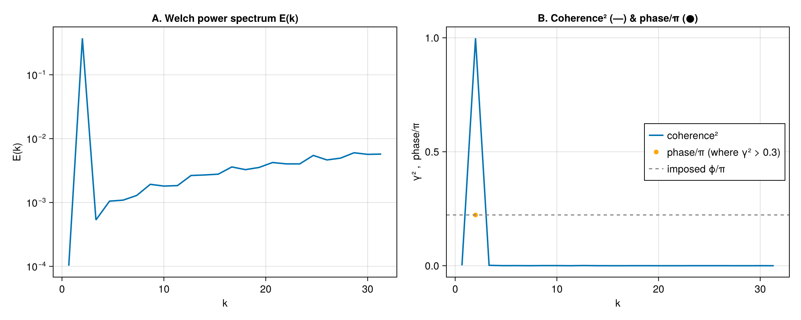

# Cross-spectra & flux by scale

The **co-spectrum** `Co_{fg}(k) = Re S_{fg}(k)` distributes a covariance such as the momentum
flux `⟨u'w'⟩` across scales — a staple of boundary-layer and turbulence analysis. Here two
correlated fields share a common large-scale mode plus independent small-scale structure.

```julia
using FlowFieldSpectra: FlowFieldSpectra as FFS
using FFTW: FFTW                          # activates the FFT extension
using SpectralBackends: SpectralBackends as SB
using FlowGeometries: FlowGeometries as FG

L = 2π
N = 64
xs = range(0.0, L; length = N + 1)[1:N]

u = [cos(2x) + 0.5 * sin(6y) for x in xs, y in xs]     # shared mode at k≈2, own structure at k≈6
w = [cos(2x) - 0.4 * cos(9x) for x in xs, y in xs]     # shared mode at k≈2, own structure at k≈9

grid = FG.Grids.StructuredGrid(FG.Geometry.CartesianGeometry{Float64}(), xs, xs;
    periodic = (true, true), period = (L, L))
cu, ks = FFS.calculate_spectrum(grid, u, (N, N); transform = SB.FFTSpectralBackend())
cw, _ = FFS.calculate_spectrum(grid, w, (N, N); transform = SB.FFTSpectralBackend())

k, Co = FFS.cospectrum(ks, cu, cw; num_bins = 24)
```

The co-spectrum peaks at the shared scale (`k ≈ 2`) and is near zero where the two fields have
independent structure.

## Welch averaging, coherence & phase

A single realization gives a noisy estimate and no meaningful coherence. Averaging over an
ensemble of realizations (the trailing axis of the coefficient array) reduces variance and lets us
estimate the **magnitude-squared coherence** `γ²(k) ∈ [0, 1]` and the **phase** between the two
fields.

To recover a meaningful phase we use **complex (rotary) signals** — e.g. a horizontal velocity
`u + iv`. A complex field has spectral content at `+k` only, so the cross-spectrum phase survives
the radial binning; for a pair of *real* fields the `±k` modes are complex conjugates and the binned
phase cancels to zero. Each realization here shares a rotating mode at `k ≈ 2` with a fixed phase
lead `ϕ`, plus independent structure elsewhere.

```julia
using Random: Random
Random.seed!(1)

nreal = 32
ϕ = 0.7                                        # fixed phase lead of g over f at the shared mode
Cf = zeros(ComplexF64, N, N, nreal)
Cg = zeros(ComplexF64, N, N, nreal)
for r in 1:nreal
    a = 1.0 + 0.1 * randn()                    # shared-mode amplitude jitter
    fr = [a * exp(im * 2x) + 0.5 * exp(im * (5x) + im * 2π * rand()) for x in xs, y in xs]
    gr = [a * exp(im * (2x - ϕ)) + 0.5 * exp(im * (7y) + im * 2π * rand()) for x in xs, y in xs]
    cfr, _ = FFS.calculate_spectrum(grid, fr, (N, N); transform = SB.FFTSpectralBackend())
    cgr, _ = FFS.calculate_spectrum(grid, gr, (N, N); transform = SB.FFTSpectralBackend())
    Cf[:, :, r] .= cfr
    Cg[:, :, r] .= cgr
end

kw, Ef = FFS.welch_power_spectrum(ks, Cf; num_bins = 24)
kc, γ², phase = FFS.coherence_spectrum(ks, Cf, Cg; num_bins = 24)
# Phase is only meaningful where coherence is appreciable; mask the rest.
phase_plot = [γ²[i] > 0.3 ? phase[i] / π : NaN for i in eachindex(phase)]
```



Coherence is high only at the shared scale `k ≈ 2`, where the recovered phase matches the imposed
lead `ϕ` (dashed line); elsewhere the independent structure drives coherence toward zero (and the
phase, masked here, is meaningless).
