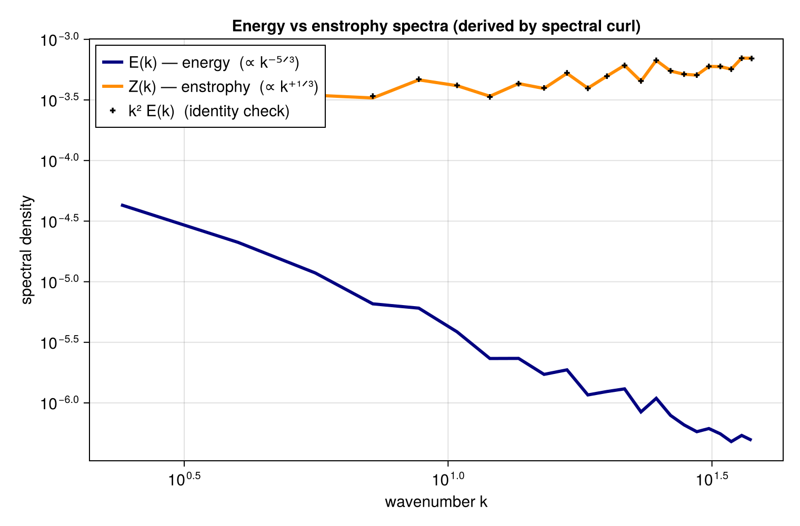

# Derived-quantity spectra (vorticity, divergence, enstrophy)

`FlowFieldSpectra` forms the kinetic-energy spectrum from a velocity field; the same machinery,
via spectral differentiation (`ik^α`), gives the spectra of **vorticity**, **divergence**, and
**enstrophy**. To show the canonical relationship we use a synthetic **incompressible turbulent**
flow with a Kolmogorov `k⁻⁵ᐟ³` energy cascade — for which the enstrophy spectrum is
`Z(k) = k² E(k) ∝ k⁺¹ᐟ³`.

```julia
using FlowFieldSpectra: FlowFieldSpectra as FFS
using FFTW: FFTW                          # activates the FFT extension
using Random: Random
using SpectralBackends: SpectralBackends as SB
using FlowGeometries: FlowGeometries as FG

L = 2π
N = 128
xs = range(0.0, L; length = N + 1)[1:N]

# Synthetic incompressible turbulence: build a broadband streamfunction ψ, then derive the
# velocity by spectral differentiation u = ∂ψ/∂y, v = -∂ψ/∂x (so ∇·u = 0 by construction).
# ψ's slope is chosen so the velocity energy follows a k⁻⁵ᐟ³ cascade.
Random.seed!(1)
freq = [0:(N ÷ 2 - 1); -(N ÷ 2):-1] .* (2π / L)        # FFTW-order wavenumbers
ψ̂ = FFTW.fft(randn(N, N))
for j in 1:N, i in 1:N
    k = hypot(freq[i], freq[j])
    ψ̂[i, j] *= k == 0 ? 0.0 : k^(-(11 / 3 + 1) / 2)
end
u = real(FFTW.ifft([im * freq[j] * ψ̂[i, j] for i in 1:N, j in 1:N]))    # (N, N) field tensors
v = real(FFTW.ifft([-im * freq[i] * ψ̂[i, j] for i in 1:N, j in 1:N]))

grid = FG.Grids.StructuredGrid(FG.Geometry.CartesianGeometry{Float64}(), xs, xs;
    periodic = (true, true), period = (L, L))
coeffs, ks = FFS.calculate_spectrum(grid, (u, v), (N, N); transform = SB.FFTSpectralBackend())

# Spectral operators: divergence ≈ 0 (incompressible); vorticity → enstrophy spectrum.
divc = FFS.spectral_divergence(ks, coeffs)
vortc = FFS.spectral_vorticity(ks, coeffs)
@show maximum(abs, divc)                   # ~machine epsilon: the field is divergence-free

# Fold the trailing component axis (dim 3) into each energy spectrum.
k, E = FFS.isotropic_spectrum(ks, coeffs; num_bins = 40, dims = 3)
_, Z = FFS.isotropic_spectrum(ks, vortc; num_bins = 40, dims = 3)

rng = 2:findlast(<=(0.6 * maximum(k)), k)  # resolved inertial range
```



`E(k)` and `Z(k)` are well-separated power laws with opposite slopes, and the `k² E(k)` markers fall
exactly on the directly-computed enstrophy `Z(k)` — the `Z = k²E` identity, a validation cross-check
for the spectral-curl operator on an incompressible field.
