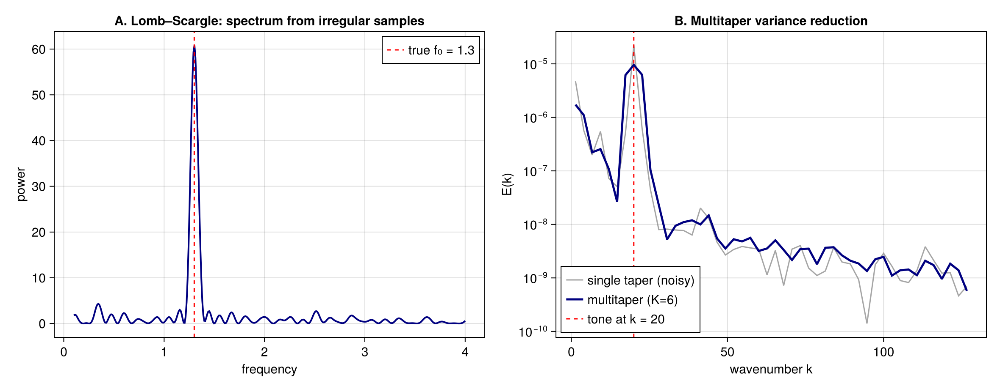

# Irregular sampling & windowed estimation

Two estimators for data that an FFT can't handle directly: the **Lomb–Scargle** periodogram for
irregularly-sampled series, and **multitaper** (DPSS / Slepian) averaging for low-variance spectra
of short records.

## Lomb–Scargle (irregular sampling)

Moorings, drifters, and satellite tracks sample at uneven times. `lomb_scargle` estimates the
spectrum directly from `(t, y)` at a chosen set of (strictly positive) frequencies — no
interpolation onto a regular grid.

```julia
using FlowFieldSpectra: FlowFieldSpectra as FFS
using Random: Random
Random.seed!(7)

N = 250
t = sort(rand(N) .* 10.0)                  # irregular sample times in [0, 10]
f0 = 1.3
y = @. sin(2π * f0 * t) + 0.3 * randn()
freqs = range(0.1, stop = 4.0, length = 400)
P = FFS.lomb_scargle(t, collect(y), collect(freqs))
```



The periodogram peaks at the true frequency `f₀ = 1.3` despite the uneven sampling and noise.

## Multitaper (DPSS) variance reduction

For a short, uniformly-sampled record, a single periodogram is noisy. The discrete prolate
spheroidal sequences (`dpss`) form an orthogonal family of optimally band-limited tapers; averaging
the spectra of the tapered signal yields a low-variance estimate. The taper spectra stack along the
realization axis and reuse the [Welch averaging](cross_spectra.md) path.

```julia
using FFTW: FFTW                          # activates the FFTBackend extension

Nx = 256
L = 2π
dx = L / Nx
x = range(0.0, stop = L - dx, length = Nx)
freq = [0:(Nx ÷ 2 - 1); -(Nx ÷ 2):-1]
bg = real(FFTW.ifft(FFTW.fft(randn(Nx)) .* [k == 0 ? 0.0 : abs(k)^(-1.0) for k in freq]))
k0 = 20
sig = @. 0.25 * cos(k0 * x) + bg            # tone at k₀ on a k⁻² (red-noise) continuum

K = 6
V = FFS.dpss(Nx, 4.0, K)                    # N×K taper matrix (NW = 4)
grid = FFS.UniformCartesianGrid((collect(x),); domain_size = (L,))
C = zeros(ComplexF64, Nx, K)
for k in 1:K
    c, ks1 = FFS.calculate_spectrum(grid, (V[:, k] .* sig,), (Nx,); transform = FFS.FFTBackend())
    C[:, k] .= c[:, 1]
    global ks = ks1
end
kb, Emt = FFS.welch_power_spectrum(ks, C; num_bins = 48)

# Compare against a single taper computed the same way, so only the variance differs (the tapers
# carry a normalization that a raw periodogram would not, which would offset the levels).
kb1, Esingle = FFS.welch_power_spectrum(ks, C[:, 1:1]; num_bins = 48)
```

The multitaper estimate is markedly smoother than a single taper at the same level, while preserving
the spectral peak at `k₀ = 20`.
