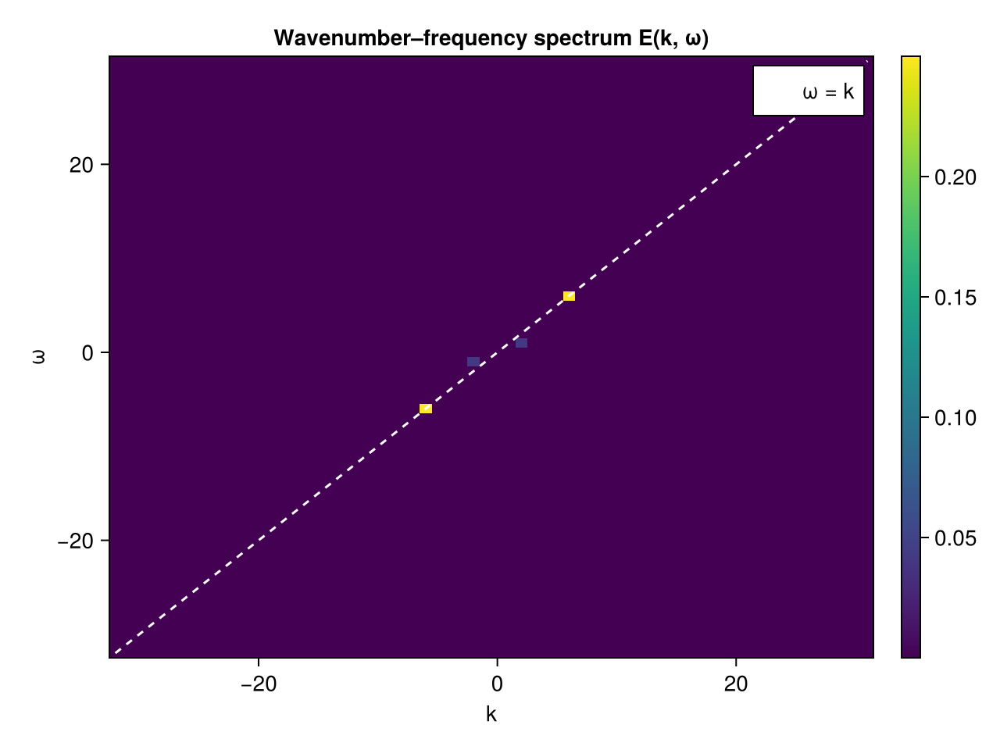

# Wavenumber–frequency `E(k, ω)`

Time is just another spectral axis. Sampling a 1D field `f(x, t)` on a uniform space–time grid and
transforming **both** axes gives the wavenumber–frequency spectrum `E(k, ω)`, which separates
propagating waves (energy on the dispersion line `ω = c·k`) from non-propagating turbulence.

Here we superpose a propagating wave on a slower background. The package's synthesis convention is
`f = Σ C(k,ω) e^{+i(k·x + ω·t)}`, so a wave written as `cos(k₀x + ω₀t)` has its spectral peaks on
the `ω = k` diagonal (phase speed `c = ω₀/k₀`); a mode with a different phase speed lies off it.

```julia
using FlowFieldSpectra: FlowFieldSpectra as FFS
using FFTW: FFTW                          # activates the FFT extension
using Random: Random
using SpectralBackends: SpectralBackends as SB
using FlowGeometries: FlowGeometries as FG
Random.seed!(0)

Nx, Nt = 64, 64
Lx, Lt = 2π, 2π
x = range(0.0, Lx; length = Nx + 1)[1:Nx]
t = range(0.0, Lt; length = Nt + 1)[1:Nt]

k0, ω0 = 6.0, 6.0                          # phase speed c = ω0/k0 = 1  → on the ω = k line
# f(x, t) as an (Nx, Nt) tensor: a wave on the ω = k line plus a slower off-line background.
f = [cos(k0 * xi + ω0 * ti) + 0.4 * cos(2 * xi + 1.0 * ti + 0.5) for xi in x, ti in t]

# dim 1 = space (→ k), dim 2 = time (→ ω)
grid = FG.Grids.StructuredGrid(FG.Geometry.CartesianGeometry{Float64}(), x, t;
    periodic = (true, true), period = (Lx, Lt))
coeffs, ks = FFS.calculate_spectrum(grid, f, (Nx, Nt); transform = SB.FFTSpectralBackend())
kx, kω = ks
Ekω = abs2.(coeffs)
```



The dominant peak sits on the `ω = k` dispersion line at `(k₀, ω₀) = (6, 6)` (and its conjugate at
`(−6, −6)`); the weaker background mode lies off the line at a slower phase speed. Building the same
field on a fixed nonuniform horizontal grid with the plan reused across time is shown in the
[4D fixed-grid example](horizontal_4d.md).
