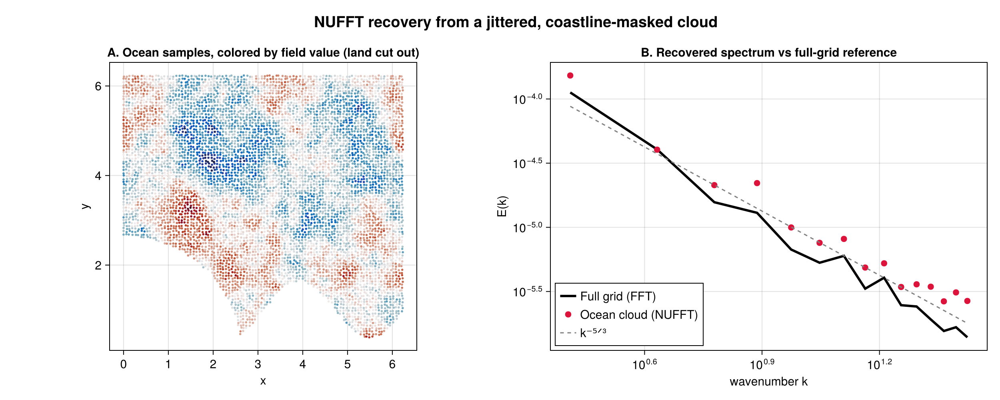

# NUFFT: jittered points & a coastline cutout

Real observational data rarely sit on a clean grid, and part of the domain is often missing
(land, gaps, masked regions). The non-uniform FFT (FINUFFT) recovers the spectrum directly from a
scattered, *masked* point cloud. Here we jitter the sample locations off the grid and remove
"land" with an analytic coastline (a corner island plus a wavy coast), then compare the recovered
spectrum against the true spectrum from the full uniform grid.

```julia
using FlowFieldSpectra: FlowFieldSpectra as FFS
using FFTW: FFTW                          # activates the FFTBackend extension
using FINUFFT: FINUFFT                    # activates the NUFFTBackend extension
using Random: Random
Random.seed!(42)

L = 2π
N = 64
dx = L / N
xs = range(0.0, stop = L - dx, length = N)
xv = vec([x for x in xs, y in xs])
yv = vec([y for x in xs, y in xs])

field(x, y) = cos(3x) + 0.6 * sin(5y) + 0.4 * cos(2x + 4y)

# Reference spectrum on the full uniform grid.
grid = FFS.UniformCartesianGrid((xv, yv); domain_size = (L, L))
c_fft, k_fft = FFS.calculate_spectrum(grid, (field.(xv, yv),), (N, N); transform = FFS.FFTBackend())
k_ref, E_ref = FFS.isotropic_spectrum(k_fft, c_fft; num_bins = 24)

# Jitter the points off the grid, then cut out "land".
xj = clamp.(xv .+ (rand(length(xv)) .- 0.5) .* (0.4dx), 0.0, L)
yj = clamp.(yv .+ (rand(length(yv)) .- 0.5) .* (0.4dx), 0.0, L)
is_land(x, y) = ((x)^2 + (y)^2 < (0.45L)^2) || (y < 0.18L + 0.10L * sin(4π * x / L))
ocean = .!is_land.(xj, yj)
xo, yo = xj[ocean], yj[ocean]
fo = field.(xo, yo)

# NUFFT on the irregular ocean-only cloud.
ocean_grid = FFS.ScatteredCartesianGrid((xo, yo); domain_size = (L, L))
c_nu, k_nu = FFS.calculate_spectrum(ocean_grid, (fo,), (N, N); transform = FFS.NUFFTBackend(), eps = 1e-9)
k_b, E_nu = FFS.isotropic_spectrum(k_nu, c_nu; num_bins = 24)
```


