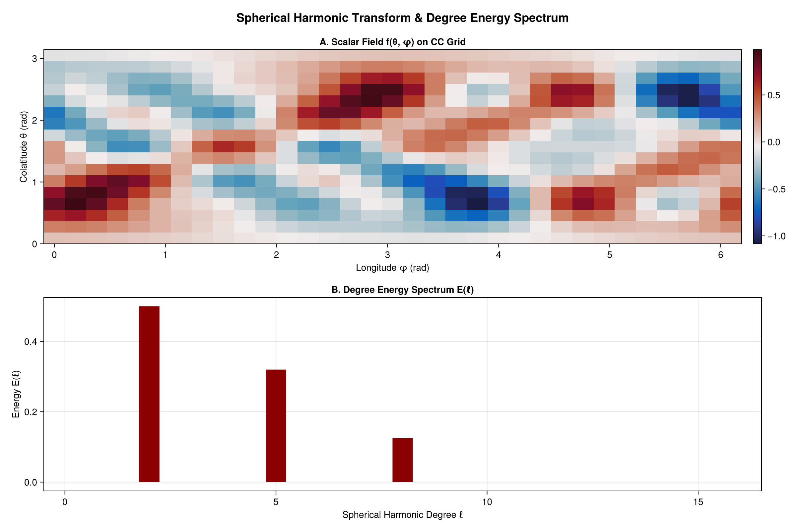

# Spherical harmonic spectra

Project a field on the sphere onto spherical harmonics and read off the degree (`ℓ`) energy
spectrum. We synthesize a field from known modes `Y₂¹` and `Y₅⁻³` on a Clenshaw–Curtis grid and
recover them with the structured `FSHTSpectralBackend`.

```julia
using FlowFieldSpectra: FlowFieldSpectra as FFS
using FastSphericalHarmonics: FastSphericalHarmonics as FSH
using SpectralBackends: SpectralBackends as SB
using FlowGeometries: FlowGeometries as FG

lmax = 16
Nθ = lmax + 1
Nφ = 2 * lmax + 1

# Clenshaw–Curtis grid (FlowGeometries) — the grid FastSphericalHarmonics transforms on. Fields are
# (nlon, nlat) tensors in FlowGeometries' longitude-first layout.
grid = FG.Connectivity.structured_grid(Float64, FG.SphericalSampling.ClenshawCurtisSampling(), Nθ)

C = zeros(ComplexF64, Nθ, Nφ)
C[FFS.sph_mode_index(2, 1)] = 1.0
C[FFS.sph_mode_index(5, -3)] = 0.5
f = real(FFS.synthesize(grid, C, (Nθ, Nφ)))       # (nlon, nlat) field on the grid

coeffs, _ = FFS.calculate_spectrum(grid, f, (Nθ, Nφ); transform = SB.FSHTSpectralBackend())
deg, E_l = FFS.spherical_energy_spectrum(coeffs)
```



Energy appears only at degrees `ℓ = 2` and `ℓ = 5`, as expected. Scattered points on the sphere
are handled the same way with an `FG.Grids.UnstructuredGrid` over a `SphericalGeometry` and the
`NUFSHTSpectralBackend` (use a well-distributed set such as a Fibonacci sphere so the least-squares
solve is well-conditioned).
