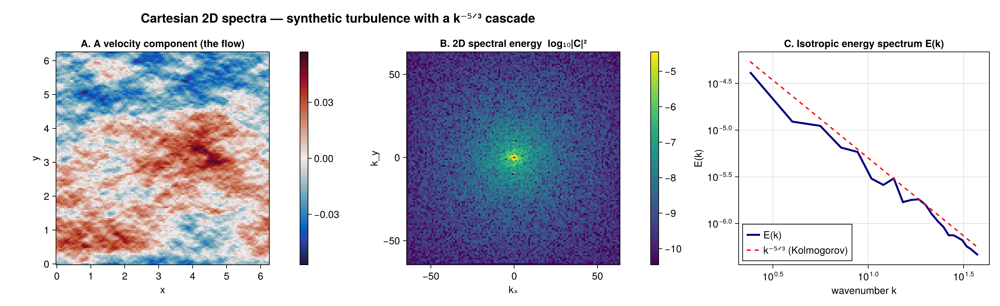

# FlowFieldSpectra.jl

`FlowFieldSpectra.jl` provides a unified, performance-oriented Julia interface for computing spectral coefficients and spatial energy reductions from flow fields across uniform or unstructured multi-dimensional grids.

---

## Installation

Install the package via Julia's package manager:

```julia
using Pkg
Pkg.add("FlowFieldSpectra")
```

---

## Unified Workflow Guide

A typical flow field spectral analysis consists of three main steps:

1. **Coordinate and Field Setup**: Define your grid coordinates (zonal, meridional, vertical, or spherical latitude/longitude) and spatial velocity field values.
2. **Spectral Transform**: Run `calculate_spectrum` with a chosen backend (e.g. `DirectSumSpectralBackend`, `FFTSpectralBackend`, `NUFFTSpectralBackend`, etc.).
3. **Spectral Reductions**: Convert high-dimensional Fourier coefficients to meaningful energy spectra (e.g., 1D isotropic / radial energy density, 1D slice/transect, or spherical degree energy spectra).

### Quickstart Tutorial: Cartesian 2D Flow Field

A complete example computing the isotropic energy spectrum of a 2D uniform flow field. You
construct an explicit **grid** (the coordinate system is the grid type — there is no guessing)
and pass it to `calculate_spectrum`.

```julia
using FlowFieldSpectra: FlowFieldSpectra as FFS
using FFTW: FFTW                     # activates the FFT extension
using SpectralBackends: SpectralBackends as SB
using FlowGeometries: FlowGeometries as FG

# 1. Axes of a uniform, periodic Cartesian grid
L = 2π
N = 32
xs = range(0.0, L; length = N + 1)[1:N]

# 2. Zonal/meridional velocities as (N, N) field tensors
u = [cos(2x) + 0.5 * sin(5y) for x in xs, y in xs]
v = [sin(2x) for x in xs, y in xs]

# 3. Build the grid (FlowGeometries) and compute Fourier coefficients (the FFT backend needs FFTW)
grid = FG.Grids.StructuredGrid(FG.Geometry.CartesianGeometry{Float64}(), xs, xs;
    periodic = (true, true), period = (L, L))
coeffs, ks = FFS.calculate_spectrum(grid, (u, v), (N, N); transform = SB.FFTSpectralBackend())

# 4. Radially integrate to a 1D isotropic (kinetic) energy spectrum (fold the component axis)
k_bins, E_k = FFS.isotropic_spectrum(ks, coeffs; num_bins = 16, dims = 3)
```


